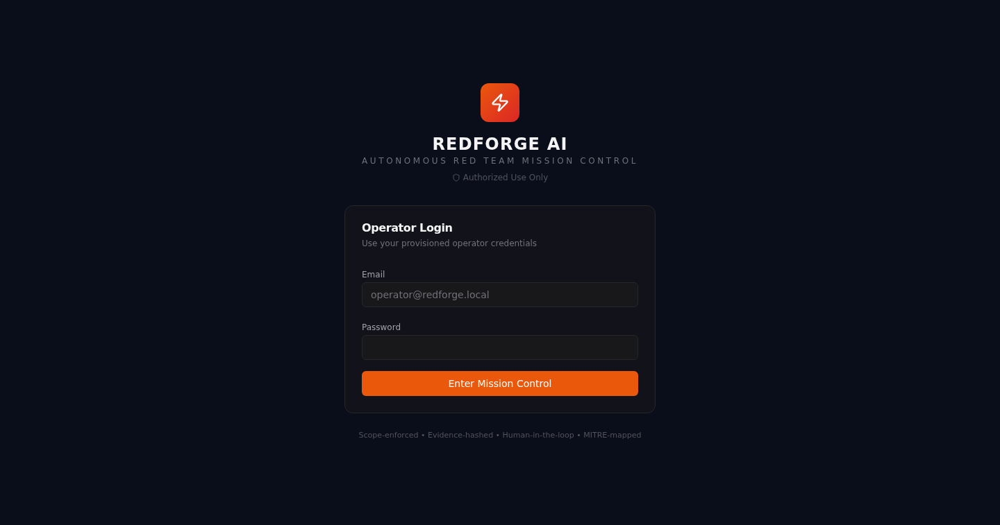
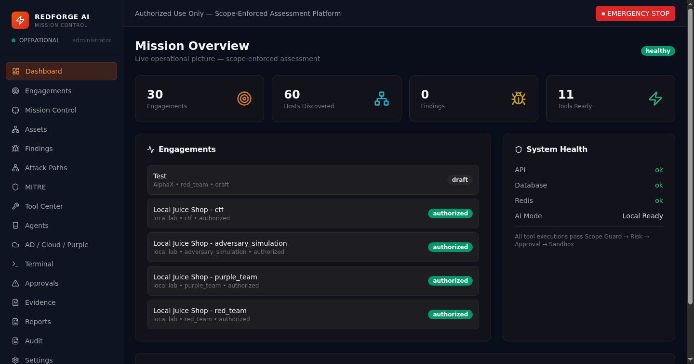
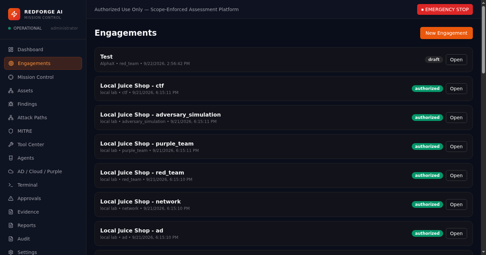
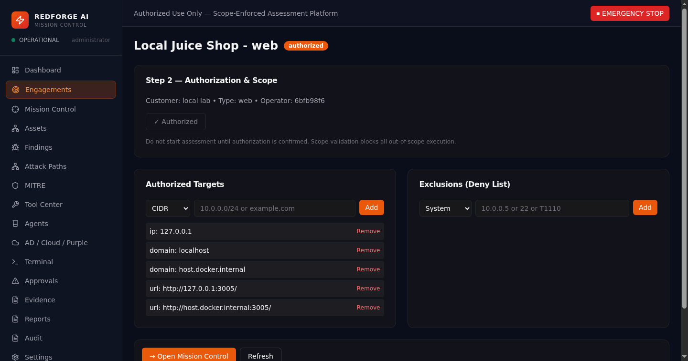
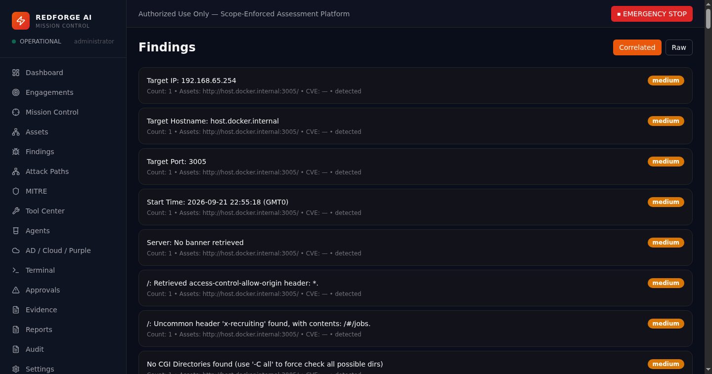
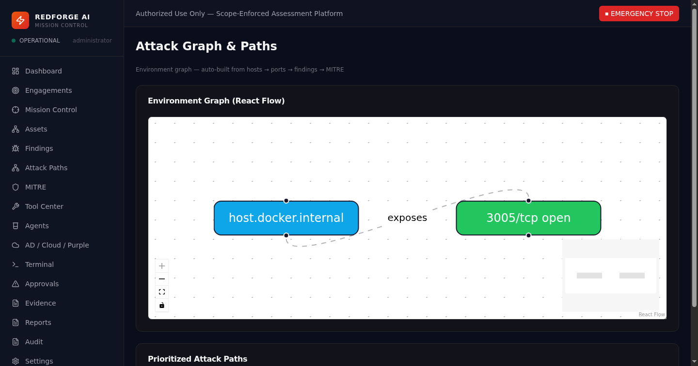
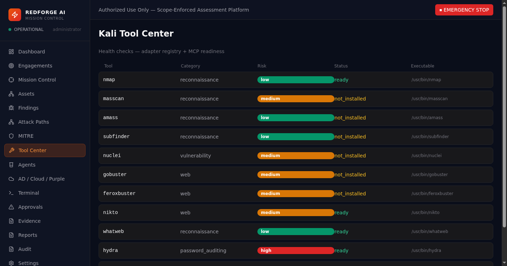
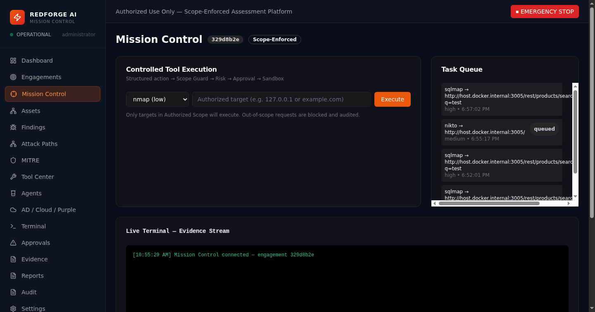
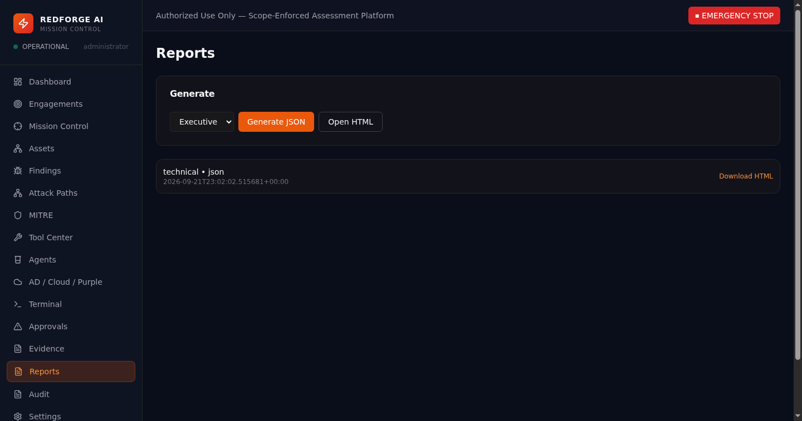
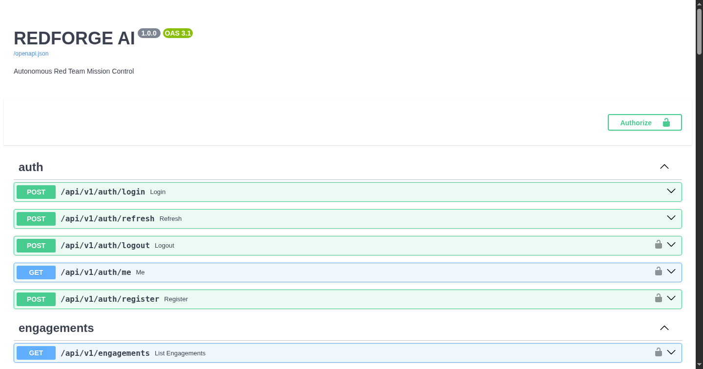

# REDFORGE AI — Autonomous Red Team Mission Control

> **Authorized Use Only** — For penetration tests, adversary simulations, CTFs, cyber ranges, and laboratory environments with explicit written authorization.

Professional AI-augmented red-team platform that orchestrates Kali Linux tooling through a controlled gateway, with scope enforcement, evidence integrity, MITRE ATT&CK mapping, and human-in-the-loop approvals.



## Architecture at a Glance

```
                     REDFORGE AI
                          |
                ┌─────────▼─────────┐
                │    Web GUI / UI   │  React + TS + Tailwind + shadcn + React Flow
                └─────────┬─────────┘
                          |
                ┌─────────▼─────────┐
                │ Mission Controller│  FastAPI + SQLAlchemy + Redis + WebSockets
                └─────────┬─────────┘
                          |
          ┌───────────────┼────────────────┐
          │               │                │
    ┌─────▼─────┐   ┌────▼─────┐    ┌────▼─────┐
    │ AI Planner│   │ Policy    │    │ Evidence │
    │ / Agents  │   │ Engine    │    │ Engine   │
    └─────┬─────┘   └────┬──────┘    └────┬─────┘
          │              │                │
          └──────────────┼────────────────┘
                         |
                 ┌───────▼────────┐
                 │ Tool Orchestr. │  Registry + Adapters + Sandbox
                 └───────┬────────┘
                         |
    ┌────────────────────┼────────────────────┐
    │                    │                    │
┌────▼────┐         ┌─────▼─────┐        ┌────▼────┐
│ Kali    │         │ Containers│        │ Remote  │
│ Tools   │  ◄────► │ / Labs    │        │ Agents  │
└─────────┘  Moses  └───────────┘        └─────────┘
```

## Quick Start

```bash
cp .env.example .env   # then set JWT_SECRET, DATABASE_URL, SEED_ADMIN_PASSWORD
docker compose up --build -d
# Frontend: http://localhost:3088   (FRONTEND_PORT, dev)
# API:      http://localhost:8088/docs
# API health: http://localhost:8088/healthz
```

Or `bash run.sh` (dev) / `bash scripts/prod-up.sh` (production overlay).
Default operator after seed: `admin@redforge.local` (password from `SEED_ADMIN_PASSWORD`).

Production ports default to API `:8000` / frontend `:80` — see `docs/PRODUCTION.md`.

## Monorepo Layout

```
redforge-ai/
├── frontend/          React + Vite + Tailwind + shadcn (+ nginx prod image)
├── backend/           FastAPI + SQLAlchemy + Alembic (non-root prod image)
├── ai/                Agent definitions & prompts (spec stubs)
├── engine/            Mission / Scope / Risk / Scheduler specs (stubs; real code under backend/app)
├── tools/             Registry YAML + adapter specs (stubs; real code under backend/app)
├── evidence/          Evidence store (artifacts + hashes)
├── reporting/         Report templates
├── mitre/             ATT&CK mappings
├── database/          Migrations (see backend/alembic/versions)
├── plugins/           Plugin SDK
├── tests/             Unit / Security / Integration (52 tests)
├── docs/              Architecture & API docs + screenshots/
├── k8s/               deployment.yaml + full-stack.yaml (Namespace, PVCs, Redis, Ingress+TLS, HPA, PDB)
└── scripts/           prod-up.sh, backup.sh
```

## Safety

- Every tool execution passes Engagement authorization → Scope Guard → Risk Engine → Approval (second-person, lead/admin) → Sandbox
- Deny-by-default scope (empty scope denies); SSRF guard for out-of-scope private addresses
- Executable allowlist + secret-stripped environment + traversal-safe evidence dirs
- AI intents are structured actions, never raw shell
- Immutable audit trail + SHA-256 evidence hashing (re-verified on read)
- Per-engagement kill switch; access tokens expire in 15 min with Redis denylist

## GUI Tour

| | | |
|---|---|---|
|  |  |  |
| *Mission Overview: health + counts* | *Engagement list with status badges* | *Authorization & scope targets* |
|  |  |  |
| *Correlated findings w/ severity + MITRE* | *React Flow environment graph* | *Registry: risk badges + ready/not_installed* |
|  |  |  |
| *Operator terminal* | *Generated technical reports* | *OpenAPI/Swagger (dev)* |

More in `docs/screenshots/`: agents, approvals, evidence, audit, AD/Cloud/Purple, assets.

See `docs/` for full specifications (`API_SPEC.md` is generated from the real route table).
